# เขียน Web เพื่อติดต่อกับ Google Sign-in ใน 3 ขั้นตอน

ทุกวันนี้ การเข้าเวปแต่ละครั้งนี่ ถ้าไม่ใช่เวประดับ Google, Facebook หรือเวประดับนี้ ผมก็ไม่อยากจะจำ User/Password บางทีไม่เข้าเลยก็มี (ถึงจะใช้โปรแกรม Password Manager ผมก็ขี้เกียจพิมพ์อยู่ดี) แต่เวประดับนี้ก็คงรู้แหละ ว่าคนส่วนใหญ่ 'ขี้เกียจ' ครับ เลยสร้างมาตรฐาน [OpenID](https://openid.net/connect) ขึ้น และเราจะใช้มัน โดยใช้ Google เป็นตัวทดสอบ แต่จริงๆ แล้ว มี Facebook, Microsoft, LINE และอีกหลายเวป ซึ่งใช้มาตรฐาน OAuth เหมือนๆ กันครับ

Programming Tools ที่เราใช้:

- [Node JS](https://nodejs.org)
- [React](https://reactjs.org)
- [React Router](https://reactrouter.com), ขณะที่ใช้เป็น version 6 ครับ
- [Query String](https://www.npmjs.com/package/query-string)

หลังจาก Install Node JS แล้ว รัน:

	npx create-react-app [directory ที่จะติดตั้ง]

รอซักพัก (หลายพัก T_T) ก็จะได้ React ติดตั้งเสร็จเรียบร้อย จากนั้น Install React Router โดย:

	cd [directory ที่จะติดตั้ง]
	npm i react-router-dom@6
	npm i query-string

npm i เป็นตัวย่อของ npm install ครับ จากนั้นรันโปรแกรมด้วยคำสั่ง:

	npm start

โปรแกรมจะเปิด Browser แล้วรัน URI http://localhost:3000 ครับ

----------

## ขั้นแรก: สร้าง Project ใน Google Console

หวังว่าคุณคงสมัครสมาชิก Google อยู่แล้ว แต่ถ้ายัง ก็ขอให้สมัครซะ แล้วอย่าลืม User/Password ละครับ

ให้ไปที่ [Google Console](https://console.cloud.google.com) ถ้ามี Project แล้ว อาจจะขึ้น Project ล่าสุด ตามรูปที่ 1

[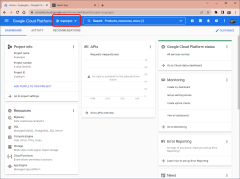](img/01-01.png)

คลิกที่กรอบสี่เหลี่ยมสีแดงด้านบน จะขึ้นรูปที่ 2

[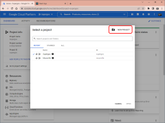](img/01-02.png)

รูปที่ 2: คลิก NEW PROJECT จะขึ้นรูปที่ 3

[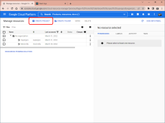](img/01-03.png)

รูปที่ 3: คลิก CREATE PROJECT จะไปยังหน้าถัดไป ตามรูปที่ 4

[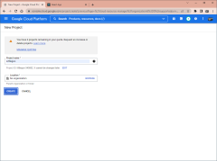](img/01-04.png)

รูปที่ 4: ใช้ชื่อ Littlegoo แล้วกด CREATE โปรแกรมจะขึ้น Notifications (มุมขวาบน) เลือก SELECT PROJECT จะได้ตามรูปที่ 5

[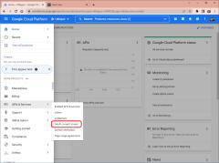](img/01-05.png)

รูปที่ 5: เลือก OAuth consent screen

[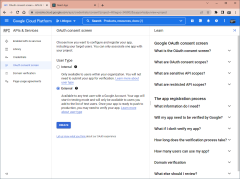](img/01-06.png)

รูปที่ 6: จะปรากฏหน้าจอ OAuth consent screen เลือก External แล้วกด CREATE จะขึ้นรูปที่ 7

[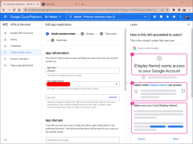](img/01-07.png)

[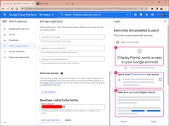](img/01-08.png)

รูปที่ 7-8: ใส่ชื่อที่จะปรากฏบนหน้าจอของ User และ Email สำหรับผู้รับผิดชอบ (ก็ Email คุณนั่นแหละครับ ^_^) คลิก SAVE AND CONTINUE เรื่อยๆ จนถึง Summary คลิก BACK TO DASHBOARD จากนั้นไปต่อรูปที่ 9

[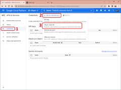](img/01-09.png)

รูปที่ 9: เลือก Menu => Credentials => CREATE CREDENTIALS => OAuth client ID จะขึ้นหน้าจอที่ 10

[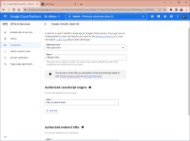](img/01-10.png)

รูปที่ 10: ใส่ค่า

- Application type: เลือก Web application
- Name: จริงๆ ตั้งอะไรก็ได้ แต่ผมใช้ Littlegoo Web
- Authorized JavaScript origins: เพิ่ม http://localhost:3000
- Authorized redirect URIs: เพิ่ม http://localhost:3000/signin

จากนั้นกด SAVE จะได้รูปที่ 11

[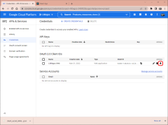](img/01-11.png)

รูปที่ 11: จะมีที่คลิกให้ Copy ค่า เราต้องการ Client Id และ Client Secret ครับ

----------

## ขั้นต่อมา: เพิ่ม Link ไป Google

ในตอนนี้เรา จะเขียน Code เพื่อต่อกับ Google

ก่อนอื่น กำหนดว่าเวปเรา จะมี Page อะไรบ้าง ใน App.js

	import { BrowserRouter, Routes, Route } from 'react-router-dom';
	import HomePage from './HomePage';
	import SignInPage from './SignInPage';

	export default function App() {
		return (
			<BrowserRouter>
				<Routes>
					{/* หน้าแรก */}
					<Route path="/" element={<HomePage />} />

					{/* หน้ารับ code จาก Google */}
					<Route path="signin" element={<SignInPage />} />
				</Routes>
			</BrowserRouter>
		);
	}

เป็นเวปสั้นๆ แค่ 2 หน้า คือ
- HomePage: เป็นไฟล์เริ่มต้น และจะเอา Link ไว้ที่ไฟล์นี้
- SignInPage: เป็นไฟล์ที่รอรับ จาก Google เมื่อ Sign-in สำเร็จ

----------

ถัดมา ไฟล์ Settings.js เป็นค่าที่ได้จากขั้นตอนแรก คือ Client Id และ Client Secret ตามนี้ครับ

	export const Settings = {
		// ใช้ Client Id และ Client Secret ที่คุณได้จากตอนแรก ก๊อป ตัด แปะ ตรงนี้ครับ
		clientId: '000000000000-11111111222223333334444445555555.apps.googleusercontent.com',
		clientSecret: '666666-777-888888888999999999999999',

		scope: [
			`https://www.googleapis.com/auth/userinfo.profile`,
			`https://www.googleapis.com/auth/userinfo.email`,
		],

		signIn: () => `https://accounts.google.com/o/oauth2/v2/auth`
			+ `?redirect_uri=http://localhost:3000/signin`
			+ `&client_id=${Settings.clientId}`
			+ `&access_type=offline&response_type=code&prompt=consent`
			+ `&scope=${Settings.scope.join(' ')}`,
	};

	export default Settings;

----------

ไฟล์ HomePage.js นี่ ง่ายเลยครับ Link เดียว ตามข้างล่างครับ

	import { Settings } from './Settings';

	export default function HomePage() {
		return (
			

				<a href={Settings.signIn()}>Sign-in Google</a>
			

		);
	}

----------

สุดท้าย ไฟล์ SignInPage.js ตอนนี้ใส่ Page ว่างๆ ไว้ก่อน แบบนี้ครับ

	export default function SignInPage() {
		return (
			

		);
	}

พอรัน จะได้หน้า Link เดียว, Sign-in Google, ซึ่งพอคลิก จะมี Dialog มาตรฐานซึ่งเดี๋ยวนี้ แทบทุกคนที่เล่นเวปรู้จักดี ตามรูปที่ 12

[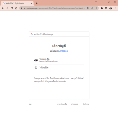](img/02-01.png)

พอคลิกเลือก User ก็จะไป Redirect URI ตามที่เรากำหนดไว้ใน Settings.js (ตรง ?redirect_uri=http://localhost:3000/signin) อย่าลืม ต้อง Set ค่า Authorized redirect URIs ใน Google Console ให้ตรงกันครับ

----------

## ขั้นสุดท้าย: เพิ่ม Page สำหรับรับ Code จาก Google

ต่อไป เราจะเขียน Code ใน SignInPage.js เริ่มจาก Import:

	import { useState, useEffect } from 'react';
	import { useSearchParams } from 'react-router-dom';
	import queryString from 'query-string';
	import Settings from './Settings';

ต่อมา ข้างใน function ประกาศตัวแปรที่ต้องใช้

	// เพื่อเอาค่า code จาก query string
	const [searchParams,] = useSearchParams();

	// ตอนเริ่ม load, ให้ set ตัวแปร done เป็น true จะไม่ load อีก
	const [done, setDone] = useState(false);

	// ตอนจบ, set ตัวแปร data เป็นข้อมูลที่ได้มา
	const [data, setData] = useState();

อ่านค่า Code จาก Query String

	const code = searchParams.get('code');
	console.log(`code: ${code}`);

ยิง Service เพื่อขอค่า Token โดยส่ง Code ที่มากับ Query String พร้อม Parameters อื่นๆ

	let token;
	{
		const uri = `https://oauth2.googleapis.com/token`;
		const options = {
			method: 'POST',
			headers: {
				'Content-Type': 'application/x-www-form-urlencoded',
			},
			body: queryString.stringify({
				code,
				client_id: Settings.clientId,
				client_secret: Settings.clientSecret,
				redirect_uri: redirectUri,
				grant_type: 'authorization_code',
			}),
		};

		... handle error ...
	}

จากนั้นใช้ Token ที่ได้มา ยิง Service เพื่อขอค่า User Information

	let user;
	{
		const uri = `https://www.googleapis.com/oauth2/v1/userinfo?alt=json&access_token=${token.access_token}`;
		const options = {
			method: 'GET',
			headers: {
				'Authorization': `Bearer ${token.id_token}`,
			},
		};

		... handle error ...
	}

Code ทั้งหมดข้างต้น จะรันตอนเริ่ม Page

	useEffect(() => {
		if (!done) {
			setDone(true);
			signIn().then((result) => {
				if (result)
					setData(result);
			});
		}
	}, [done, signIn]);

ได้ Token และ User เสร็จเรียบร้อย (ถ้าไม่มีปัญหา)

	

		
Email: {data.user.email}

		
Name: {data.user.name}

		

		
User JSON: <output>{JSON.stringify(data.user, null, 2)}</output>

		
Token JSON: <output>{JSON.stringify(data.token, null, 2)}</output>

	

ลองรันใหม่ เริ่มจาก Sign-in ใหม่เลย จะได้ผลลัพธ์ ประมาณรูปที่ 13

[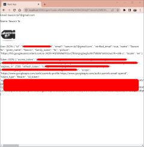](img/03-01.png)

----------

## สรุป

การใช้ Google Sign-in ไม่ใช่เรื่องยาก แต่ทำให้เวปน่าเข้ายิ่งขึ้นครับ

ยังมีเรื่อง Scope ที่ผมผ่านไปก่อน คือ ไม่ว่าเราจะทำเรื่องอะไร ต้องขอสิทธิก่อน สิ่งสิทธิเหล่านี้ ดูได้จาก:

	https://developers.google.com/identity/protocols/oauth2/scopes

พบกันใหม่ ในเรื่องต่อไปครับ (ซึ่งก็ยังไม่แน่ใจว่า เป็นเรื่องอะไรครับ) สวัสดี

Attachment: https://github.com/taworn-ta7/articles.google.signin.git

